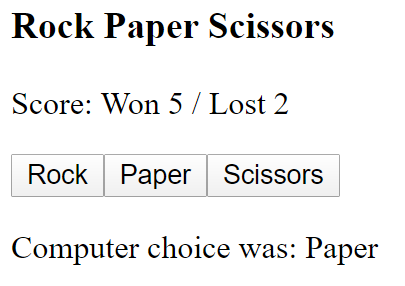

# CS569 Homework 05
## Angular Change Detection
Your will build a Rock-Paper-Scissors game application with Angular framework, the application has the following tree structure:  
* AppComponent (root)
  * button (reusable) x3
  * score (reusable)
    
### Application Specifications
* The root component will have the following state: `{w: number, l: number, computer: string}` to track number of wins/losses, and hold the computer choice. Score will be displayed using the reusable score component. Implement all actions in `AppComponent` having in mind that the state should be immutable. Display the previous computer choice after every state change.
* Game choices should be declared as `enum`.  Display all three game choices using the reusable button component. Pass the button label and function that needs to be triggered on click event.
* Implement `OnChanges` interface for both button and score components. Make the necessary optimizations so the hook will only trigger if one of input values change. (Only score should re-render)

